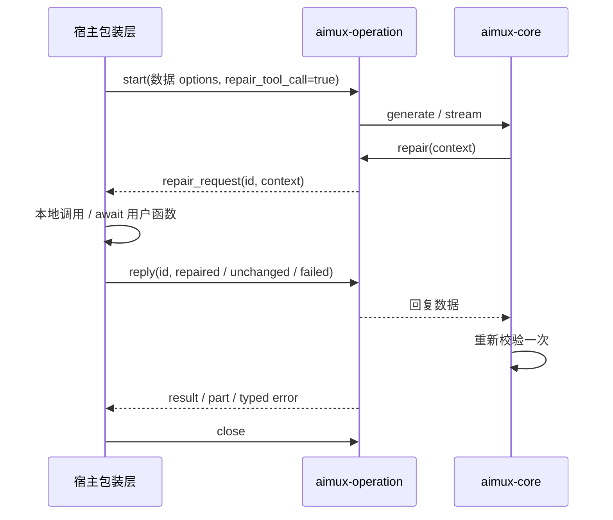

# RFC-0035: 宿主驱动的跨语言操作

> **Status**: Implemented locally — 未发布
> **Date**: 2026-09-20
> **Baseline**: master @ `d66e1951613d1f95b145b65794370510fa8690bb`
> **Related**: [PR #186](https://github.com/arcships/aimux/pull/186) @ `a2025150fa38e7bea2e09cb4ea1d8cf31f4d8492`、[错误模型](../docs/error-model.md)、[清理与消融记录](../docs/host-operation-ablation.md)

## 1. 解决的问题

Core 已实现 `ToolCallRepair`：工具查找、JSON 解析或 schema 校验失败时，允许用户修复一次，再交给 Core 校验。缺少的是多语言接入方式。

PR #186 的 C 回调注册表、Node repair bridge 与 Python 阻塞线程回调，把用户函数的保活、调度和请求生命周期分散在不同实现中。C 路径还需要处理原生回调中的嵌套生成与释放竞争。

本实现采用一个规则：**函数留在宿主，跨边界只传请求和回复。一次生成由一个 operation 拥有。**



没有宿主函数指针、callback handle、全局函数注册表，也没有泛型 hook 插件系统。目前只有 repair 一种宿主请求；新增 hook 应根据实际需求设计。

## 2. 代码边界

- `aimux-core`：生成、解析、一次修复和再校验；`GenerationControl` 统一取消与绝对 deadline。
- `aimux-operation`：纯 Rust 的请求/回复、输出队列、终态、任务所有权。依赖 Core，不依赖 C ABI、napi 或 PyO3。
- `aimux-ffi`、Node native、Python native：转换数据并调用同一个 operation 实现。
- 语言包装层：保存和执行用户函数，等待数据，映射结果，关闭 operation。

operation 使用现有 Model 的强引用，不需要创建新的 Model 工厂。Model 句柄关闭后，已启动的 operation 仍拥有模型；启动过程结束后释放模型锁，再执行宿主函数，因此 repair 可以嵌套调用 aimux。

`RawToolCall` 直接复用 Core 的可序列化类型；不再维护相同字段的 Rust wire DTO 及双向转换。

## 3. 协议 v1

启动示例：

```json
{
  "protocol_version": 1,
  "mode": "generate_text",
  "prompt": "天气如何？",
  "options": {"tools": []},
  "repair_tool_call": true
}
```

`mode` 支持 `generate_text`、`generate_object`、`consume_stream_text`、`stream_text`、`generate_text_as_openai`、`stream_text_as_openai`。未提供 options 时使用默认值，repair 开关默认为 false。

顶层只接受已知字段。options 是数据，不接受 `repair_tool_call`、`repairToolCall`、`abort_signal`；宿主包装层剥离函数与取消对象。只有一个功能开关，不使用字符串 capability 列表。

事件只有三种：

| type | 内容 | 接收位置 |
|---|---|---|
| `repair_request` | `request_id`、`context` | CONTROL / ANY |
| `part` | 原有 StreamPart 或 OpenAI chunk | OUTPUT / ANY |
| `result` | 原有聚合结果 | OUTPUT / ANY |

context 包含 `tool_call`、原始 typed `error`、`input_schema`、`tools`、当前 `messages`、可选 `instructions`。`tool_call.input` 是尚未解析的字符串，保留 provider metadata 等可选字段。未知工具的 schema 沿用 Core 行为。

回复是下列联合类型，不混用 null、异常和取消：

```json
{"type":"repaired","tool_call":{"tool_call_id":"c1","tool_name":"weather","input":"{}"}}
{"type":"unchanged"}
{"type":"failed","message":"repair failed"}
```

Core 对 repaired 重新校验，仍无效时形成既有 ToolCallRepair 错误，不重复调用 repair。unchanged 保留原始工具错误；普通宿主异常形成 failed。取消与总超时保留 Aborted / Timeout，不伪装成 repair 失败。

成功结束只用 `ENDED` 表达，不再发送 `completed` 事件。provider Finish 不是 operation 终态：可能仍有 repair 等待处理。

## 4. 状态与并发

一次 operation 持有：

- 一个终态槽：首个提交的成功或错误不可覆盖。
- 一个 pending repair：request ID、尚未读取的请求、一次性回复通道。
- 一个容量为 64 的输出队列。
- 一个 Rust driver 任务及其拥有者锁。

v1 Core 顺序执行 repair，因此无需额外控制队列。请求 ID 使用不回卷的 u64，并编码成规范十进制字符串，避免 JS 数字精度问题。不维护无限增长的历史 ID 集合：pending ID 与已发放 ID 高水位足以区分回复状态。

`reply` 在同一次锁内检查 deadline、终态、ID 并接受回复。接受后该 ID 永久失效；迟到回复不能恢复终止的 operation。

| Reply status | 数值 | 含义 |
|---|---:|---|
| ACCEPTED | 0 | 已接受 |
| ALREADY_REPLIED | 1 | 已发放但已消费的 ID |
| UNKNOWN_REQUEST | 2 | 未发放或非规范 ID |
| OPERATION_ENDED | 3 | operation 已终止 |

| Lane | 数值 | 用途 |
|---|---:|---|
| CONTROL | 0 | 只接收宿主请求 |
| OUTPUT | 1 | 只接收结果、输出和最终错误 |
| ANY | 2 | 同步宿主在同一调用线程协调控制与输出 |
| TERMINAL | 3 | 等待终态，不消费结果或错误 |

同一数据 lane 并发读取立即返回 READER_BUSY。ANY 同时占用 CONTROL 和 OUTPUT；等待 future 被丢弃后释放读取权。TERMINAL 是可重复观察的状态通知。

异步包装层的控制读取和终态监听独立于用户输出消费。用户暂停流时，已发出的 repair 仍能执行，超时仍能通知宿主。输出队列已满且 Core 尚未推进到后续 repair 时，背压按顺序生效。

失败清空未交付输出，OUTPUT/ANY 交付 typed error 一次，随后 ENDED。成功允许排空已缓冲输出再 ENDED。已取出的事件可能与终止竞争；已交付的输出不能撤回。

## 5. 超时、取消、关闭

`GenerationControl` 在启动时创建绝对预算，传给 Core，覆盖 provider 请求、重试和等待 repair。直接 Rust 调用也在相同 Core 边界等待 repair。operation 的 repair future 不再重复包装一层计时器。

`total_ms` 和当前单 step 的 `step_ms` 不随 repair 或 next 重置。`first_chunk_ms`、`chunk_ms` 保持现有 provider 到达时间语义，用户处理 repair 和消费输出的时间不重新定义 chunk timeout。未配置预算时没有隐藏的默认 repair 超时。无取消信号的旧 Core 调用不分配新的 abort token。

首个终态获胜：成功或 Timeout 已提交后，cancel 不能改写成 Aborted。cancel 唤醒所有等待，与输出容量无关。Rust 完成后用户排空已缓冲数据的时间不再计入生成预算。

高级包装层负责 scope cleanup；流的使用者仍需调用语言支持的关闭方式。Python 使用 `close/aclose` 或 `contextlib.aclosing`，Java Stream 使用 try-with-resources；保留一个未关闭的迭代器不能等同于释放它。Node `for await` 的 break 会触发 return；Dart subscription cancel 会先取消 native 等待。

C drop 顺序：从 handle 注册表移除并取得局部引用，释放注册表锁，取消并关闭 operation。专用 drop 与通用 `aimux_drop_handle` 共用逻辑；已进入 FFI 的调用持有自己的引用，新调用返回 InvalidHandle。关闭使用唯一任务拥有者锁串行完成 join，不持有注册表锁或状态锁。

close 给 Rust driver 一秒合作式退出时间，随后 abort 并 join；Drop 作为兜底中止任务。这个界限依赖 Tokio runtime 可调度，不能抢占自定义 provider future 中永久阻塞的同步代码。

Rust 从不持有宿主函数地址，因此 native 关闭不需要等待宿主函数结束。宿主取消仍是合作式：阻塞 JS/Python 事件循环、同步长任务或忽略 task cancellation 的用户代码都可能延迟高级 API 的退出。不得宣称能强制终止任意函数；迟到结果不得报告为成功或访问已释放资源。

## 6. C ABI

```c
aimux_error_t *aimux_operation_start(
    uint64_t model_handle, const char *request_json, uint64_t *out_operation);
aimux_error_t *aimux_operation_next(
    uint64_t operation, int32_t lane, int64_t wait_ms,
    char **out_event_json, int32_t *out_state);
aimux_error_t *aimux_operation_reply(
    uint64_t operation, const char *request_id, const char *reply_json,
    int32_t *out_status);
aimux_error_t *aimux_operation_cancel(uint64_t operation);
void aimux_operation_drop(uint64_t operation);
```

next 状态为 EVENT=0、WAIT_TIMEOUT=1、ENDED=2、READER_BUSY=3。`wait_ms=-1` 等待数据或终态，0 轮询，正数有界等待，其他负数拒绝。pull timeout 不修改 operation 终态。

event 字符串由 `aimux_free_string` 释放；错误使用现有 `aimux_error_t` 所有权规则。请求在函数返回前解析，不保留入参指针。CONTROL/TERMINAL 终止时直接 ENDED；OUTPUT/ANY 交付最终错误一次。非法 lane、payload 与指针走既有参数错误；reply status 不新增 provider 错误码。

cancel 对有效的终态 operation 幂等，无效 handle 报 InvalidHandle；drop 对无效 handle 幂等。C 的阻塞 next 不得直接在 JS loop、Dart UI isolate 或 Swift main actor 上运行。

## 7. 当前语言适配

| 绑定 | repair 执行位置 | 实现方式 |
|---|---|---|
| Node | 调用包装层所在 JS loop | 本地 await 函数；native async next/finished；无 repair TSFN |
| Python 同步 | 原调用线程 | next 释放 GIL 等纯数据，ANY 协调 |
| Python 异步 | 当前 asyncio loop | executor 只等纯数据；`generate_text_async` / `stream_text_async` |
| Go | 宿主驱动 goroutine | cgo 等数据，给函数本地 context；context.AfterFunc 转发取消 |
| Java | 同步调用线程 | ANY、try/finally；等待时周期检查线程中断 |
| Kotlin | 同步调用线程 | ANY、use；未新增 suspend repair API |
| Swift 同步 | 同步调用线程 | ANY、defer；closure 作为独立参数，options 保持 Codable/Equatable |
| Swift 异步 | MainActor | worker 等纯数据；MainActor 用户 closure，任务取消 |
| Dart | 创建调用的 isolate | worker isolate 只收发数据，每个 lane 单事件 ACK，FutureOr repair |

Node/Python native 对象直接拥有 Operation，不再套无用途的 Arc。C handle 注册表仍需 Arc，确保已进入边界的并发调用安全存活。

Swift 只有受锁保护的纯数据 transport 使用 `@unchecked Sendable`，用户函数不借此跨 actor。Dart 不把 Model 或用户 closure 发送到 worker。Python 同步入口拒绝 async repair；Dart 同步入口拒绝 Future 返回，异步入口显式接受。Java/Kotlin 同步 API 不暗中承诺 coroutine 调度。

无 hook 的既有入口保留原路径。新增 Python/Dart async 入口使用 operation，避免把持有 GIL 或阻塞 isolate 的旧调用伪装成异步。所有既有 C 导出保留；本实现从 master 基线实现替代方案，没有引入 #186 的注册表/Bridge API。

## 8. 输出与已有边界

OpenAI 流继续使用 Core 的 deferred tool-call 输出：工具修复完成后才交付最终参数。原生 StreamPart 仍可能包含 provider 原始 ToolInputDelta，最终 ToolCall 是校验后的值，两者不混淆。

新增 operation 输出最多缓冲 64 个事件，但单个事件大小未设上限。Core 现有 stream pump 仍有无界缓冲，Kotlin 既有 Sequence 适配仍先聚合。因此不能把局部背压宣传为端到端内存上界，也不能把消融测试当作性能 benchmark。

provider 录制保留原始响应；修复结果沿用高层结果模型。等待 repair 时超时/取消由 Core 写入正确 outcome。未新增 hook 日志框架或全链路追踪要求。

## 9. 验证与删减准则

生命周期语义集中在 Rust 测试，各语言测试负责实际 native 边界上的线程/isolate/actor、嵌套调用、异常和清理。共享最小 HTTP fixture 位于 `contract-tests/host-operation.json`。

消融在独立副本中逐项移除机制；只有测试真实执行并产生预期断言失败，才支持“该机制必要”的判断。保留共享 deadline、读取互斥、有界输出、首个终态与独立终态观察。删除 completed、重复 DTO、额外控制队列、双重关闭锁、字符串 hook 列表和重复 repair 计时器。

验证范围、运行命令及尚未验证的平台见[清理与消融记录](../docs/host-operation-ablation.md)。未增加泛型协议生成器、插件系统、未来 hook 注册层或跨进程能力。
